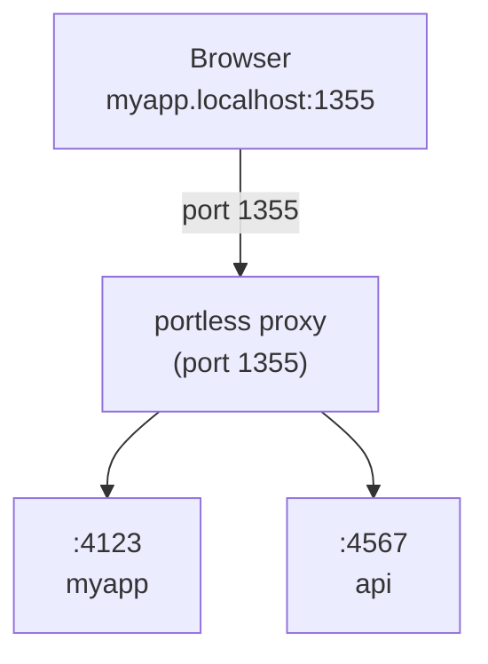

## Architecture Overview

Portless uses a proxy-based architecture to route requests from stable `.localhost` URLs to your dev servers running on ephemeral ports.



<Steps>

### Start the Proxy

The proxy auto-starts when you run an app, or you can start it explicitly:

```bash
portless proxy start
# -> HTTP proxy listening on port 1355
```

For HTTP/2 with TLS:

```bash
portless proxy start --https
# -> HTTPS/2 proxy listening on port 1355
```

### Run Your Apps

Apps register automatically when launched through portless:

```bash
portless myapp next dev
# -> Assigns port 4123, registers myapp.localhost -> 127.0.0.1:4123
```

### Access via URL

Navigate to `http://myapp.localhost:1355` in your browser. The proxy routes the request to your app.

</Steps>

## Proxy Implementation

The proxy is built with Node.js built-in modules (`http`, `http2`, `net`) with no external dependencies for the core routing logic.

### Request Routing

The proxy inspects the `Host` header to determine which backend to route to:

<CodeGroup>

```typescript proxy.ts
function findRoute(
  routes: { hostname: string; port: number }[],
  host: string
): { hostname: string; port: number } | undefined {
  return (
    // Exact match first
    routes.find((r) => r.hostname === host) ||
    // Wildcard subdomain match
    routes.find((r) => host.endsWith("." + r.hostname))
  );
}
```

</CodeGroup>

**Routing logic:**
1. **Exact match**: `myapp.localhost` matches a route registered for `myapp.localhost`
2. **Wildcard match**: `tenant1.myapp.localhost` matches a route registered for `myapp.localhost`
3. **No match**: Returns 404 with a list of active routes

### HTTP/2 + HTTP/1.1 Support

When started with `--https`, the proxy creates an HTTP/2 secure server with HTTP/1.1 fallback:

<CodeGroup>

```typescript proxy.ts
const h2Server = http2.createSecureServer({
  cert: tls.cert,
  key: tls.key,
  allowHTTP1: true,  // Enables WebSocket upgrades over HTTP/1.1
});
```

</CodeGroup>

The proxy uses **byte-peeking** to detect whether an incoming connection is TLS or plain HTTP:

<CodeGroup>

```typescript proxy.ts
const wrapper = net.createServer((socket) => {
  socket.once('readable', () => {
    const buf = socket.read(1);
    socket.unshift(buf);  // Put the byte back
    if (buf[0] === 0x16) {
      // TLS handshake -> HTTP/2 secure server
      h2Server.emit('connection', socket);
    } else {
      // Plain HTTP -> proxy over HTTP/1.1
      plainServer.emit('connection', socket);
    }
  });
});
```

</CodeGroup>

This allows the same port to accept both HTTPS and HTTP requests.

### Loop Detection

Portless detects forwarding loops (e.g., a Vite dev server proxying back through portless without rewriting the `Host` header):

<CodeGroup>

```typescript proxy.ts
const PORTLESS_HOPS_HEADER = "x-portless-hops";
const MAX_PROXY_HOPS = 5;

const hops = parseInt(req.headers[PORTLESS_HOPS_HEADER] as string, 10) || 0;
if (hops >= MAX_PROXY_HOPS) {
  // Return 508 Loop Detected with helpful error message
  res.writeHead(508, { "Content-Type": "text/html" });
  res.end(renderLoopDetectedPage());
  return;
}

// Increment hop count when forwarding
proxyReqHeaders[PORTLESS_HOPS_HEADER] = String(hops + 1);
```

</CodeGroup>

## Route Registration

Routes are stored in a JSON file at `~/.portless/routes.json` (or `/tmp/portless/routes.json` for privileged ports).

### File Locking

Route updates are protected by a directory-based lock to prevent race conditions:

<CodeGroup>

```typescript routes.ts
class RouteStore {
  private acquireLock(): boolean {
    for (let i = 0; i < maxRetries; i++) {
      try {
        fs.mkdirSync(this.lockPath);  // Atomic operation
        return true;
      } catch (err) {
        if (err.code === "EEXIST") {
          // Check for stale lock (>10s old) and remove it
          const stat = fs.statSync(this.lockPath);
          if (Date.now() - stat.mtimeMs > STALE_LOCK_THRESHOLD_MS) {
            fs.rmSync(this.lockPath, { recursive: true });
            continue;
          }
          // Wait and retry
          this.syncSleep(retryDelayMs);
        }
      }
    }
    return false;
  }
}
```

</CodeGroup>

### Stale Route Cleanup

When loading routes, portless filters out stale entries whose owning process is no longer alive:

<CodeGroup>

```typescript routes.ts
loadRoutes(persistCleanup = false): RouteMapping[] {
  const routes = JSON.parse(fs.readFileSync(this.routesPath, "utf-8"));
  
  // Filter out stale routes
  const alive = routes.filter((r) => 
    r.pid === 0 ||  // Aliases (pid 0) are never stale
    this.isProcessAlive(r.pid)
  );
  
  if (persistCleanup && alive.length !== routes.length) {
    // Persist cleaned list when holding the lock
    fs.writeFileSync(this.routesPath, JSON.stringify(alive));
  }
  
  return alive;
}
```

</CodeGroup>

### Route Format

<CodeGroup>

```json routes.json
[
  {
    "hostname": "myapp.localhost",
    "port": 4123,
    "pid": 12345
  },
  {
    "hostname": "api.myapp.localhost",
    "port": 4567,
    "pid": 12346
  },
  {
    "hostname": "postgres.localhost",
    "port": 5432,
    "pid": 0  // Alias (no owning process)
  }
]
```

</CodeGroup>

- `hostname`: The full hostname (e.g., `myapp.localhost`)
- `port`: The local port where the app is listening
- `pid`: Process ID of the app (0 for static aliases)

## Port Assignment

Portless assigns ports in the range **4000-4999** by default.

### Auto Port Discovery

<CodeGroup>

```typescript cli-utils.ts
const MIN_PORT = 4000;
const MAX_PORT = 4999;

export async function findFreePort(): Promise<number> {
  const usedPorts = new Set(
    store.loadRoutes().map((r) => r.port)
  );
  
  // Try random ports in the range
  for (let i = 0; i < 100; i++) {
    const port = MIN_PORT + Math.floor(Math.random() * (MAX_PORT - MIN_PORT + 1));
    if (!usedPorts.has(port) && await isPortFree(port)) {
      return port;
    }
  }
  
  throw new Error("No free ports available in range 4000-4999");
}
```

</CodeGroup>

### Fixed Port Override

You can specify a fixed port instead of auto-assignment:

```bash
portless myapp --app-port 3000 next dev
# or
export PORTLESS_APP_PORT=3000
portless myapp next dev
```

## Environment Variables

Portless injects environment variables into child processes:

<CodeGroup>

```typescript cli.ts
spawnCommand(commandArgs, {
  env: {
    ...process.env,
    PORT: port.toString(),              // e.g., "4123"
    HOST: "127.0.0.1",                  // Always localhost
    PORTLESS_URL: finalUrl,             // e.g., "http://myapp.localhost:1355"
    __VITE_ADDITIONAL_SERVER_ALLOWED_HOSTS: ".localhost",
  },
});
```

</CodeGroup>

### Framework Flag Injection

For frameworks that ignore `PORT` (Vite, Astro, React Router, Angular, Expo), portless auto-injects `--port` and `--host` flags:

<CodeGroup>

```typescript cli-utils.ts
export function injectFrameworkFlags(args: string[], port: number): void {
  const [cmd] = args;
  
  // Vite, Astro, etc.
  if (["vite", "astro", "ng", "expo"].includes(cmd)) {
    if (!args.includes("--port")) {
      args.push("--port", port.toString());
    }
    if (!args.includes("--host")) {
      args.push("--host", "127.0.0.1");
    }
  }
}
```

</CodeGroup>

<Info>
**Most frameworks respect `PORT` automatically** (Next.js, Express, Nuxt, Hono, Flask, FastAPI). Flag injection is only needed for a small set of frameworks.
</Info>

## State Directory

Portless stores its state in a directory that depends on the proxy port:

- **Port >= 1024** (no sudo): `~/.portless/`
- **Port < 1024** (requires sudo): `/tmp/portless/`

### State Files

```bash
~/.portless/
├── routes.json       # Active route mappings
├── routes.lock/      # Directory-based lock for route updates
├── proxy.pid         # PID of the proxy daemon
├── proxy.port        # Port the proxy is listening on
├── proxy.log         # Proxy daemon logs
├── tls.marker        # Marker file indicating TLS is enabled
├── ca.pem            # Local CA certificate (for HTTPS)
├── ca.key            # Local CA private key
├── cert.pem          # Wildcard *.localhost certificate
└── cert.key          # Certificate private key
```

Override the state directory:

```bash
export PORTLESS_STATE_DIR=/custom/path
portless proxy start
```
