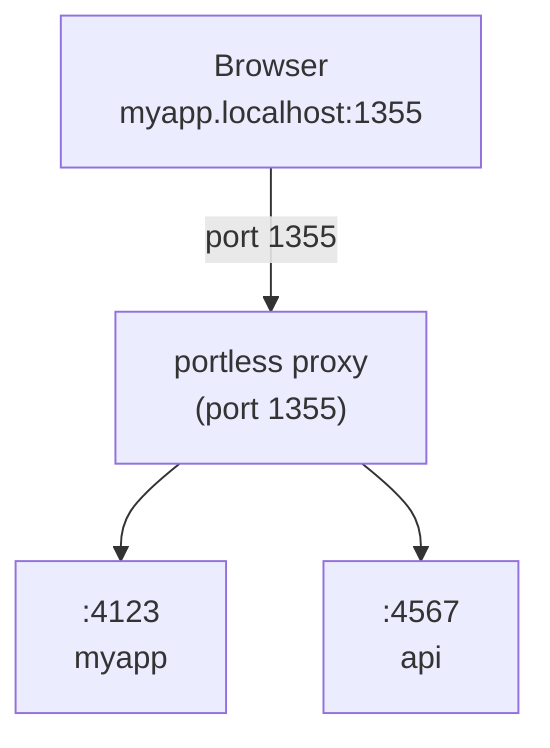

# Welcome to Portless

Portless gives every local dev server a stable, human-readable URL. No more remembering which port is which, no more conflicts, no more switching tabs to the wrong app.

```diff
- "dev": "next dev"              # http://localhost:3000
+ "dev": "portless run next dev"   # http://myapp.localhost:1355
```

## What is Portless?

Portless is a local development proxy that replaces numeric port numbers with stable, named `.localhost` URLs. Instead of juggling `localhost:3000`, `localhost:8080`, and `localhost:4000`, you get `myapp.localhost:1355`, `api.localhost:1355`, and `docs.localhost:1355`.

It works by running a lightweight reverse proxy on port 1355 (customizable) that routes requests based on the hostname. When you start your dev server with `portless`, it automatically assigns a random port to your app and registers it with the proxy, so you can access it via a clean URL.

<CardGroup cols={2}>
  <Card title="No More Port Conflicts" icon="ban">
    Every app gets a unique name instead of fighting over port 3000. `EADDRINUSE` becomes a thing of the past.
  </Card>
  <Card title="Stable URLs" icon="anchor">
    Your URL never changes. No more wondering if that tab is showing the old app that used to run on port 3000.
  </Card>
  <Card title="Human-Readable" icon="user">
    `api.myapp.localhost:1355` is easier to remember and share than `localhost:8080`. For humans and AI agents.
  </Card>
  <Card title="Git Worktree Support" icon="code-branch">
    Each worktree gets its own subdomain automatically. Main branch uses `myapp.localhost:1355`, feature branch uses `feature.myapp.localhost:1355`.
  </Card>
</CardGroup>

## Quick Example

Instead of this:

```bash
npm run dev
# Server running at http://localhost:3000
# Wait, is that the frontend or the API?
# Let me check the package.json...
```

You get this:

```bash
portless run npm run dev
# Server running at http://myapp.localhost:1355
# Crystal clear what app this is
```

And when you have multiple services:

```bash
# Terminal 1
portless myapp next dev
# -> http://myapp.localhost:1355

# Terminal 2
portless api.myapp pnpm start
# -> http://api.myapp.localhost:1355

# Terminal 3
portless docs.myapp npm run dev
# -> http://docs.myapp.localhost:1355
```

No config files, no port juggling, no conflicts. It just works.

<Info>
  The proxy auto-starts when you run an app. You can also start it explicitly with `portless proxy start`.
</Info>

## Key Features

- **Zero Config**: Works out of the box with Next.js, Express, Vite, Nuxt, React, Angular, and more
- **Auto Port Assignment**: Assigns random ports (4000-4999) automatically and injects `PORT` and `HOST` env vars
- **Subdomains**: Use `api.myapp`, `docs.myapp`, or any nested structure you want
- **Wildcard Routing**: `tenant1.myapp.localhost:1355` routes to `myapp` automatically
- **Git Worktree Detection**: Branch names become subdomains automatically
- **HTTP/2 Support**: Enable `--https` for faster dev server page loads (browsers limit HTTP/1.1 to 6 connections)
- **Static Aliases**: Register Docker containers or external services with `portless alias`

## How It Works



1. **Start the proxy** - Auto-starts when you run an app, or start explicitly with `portless proxy start`
2. **Run apps** - `portless <name> <command>` assigns a free port and registers with the proxy
3. **Access via URL** - `http://<name>.localhost:1355` routes through the proxy to your app

Apps are assigned a random port (4000-4999) via the `PORT` and `HOST` environment variables. Most frameworks (Next.js, Express, Nuxt, etc.) respect these automatically. For frameworks that ignore `PORT` (Vite, Astro, React Router, Angular, Expo, React Native), portless auto-injects the correct `--port` and `--host` flags.

## Requirements

- Node.js 20+
- macOS or Linux

<Note>
  Windows support is not currently available. Portless is designed for Unix-based systems.
</Note>

## Next Steps

<CardGroup cols={2}>
  <Card title="Quickstart" icon="rocket" href="/quickstart">
    Install Portless and run your first app in under 2 minutes
  </Card>
  <Card title="Why Portless?" icon="lightbulb" href="/why">
    Learn about the problems Portless solves and when to use it
  </Card>
</CardGroup>
